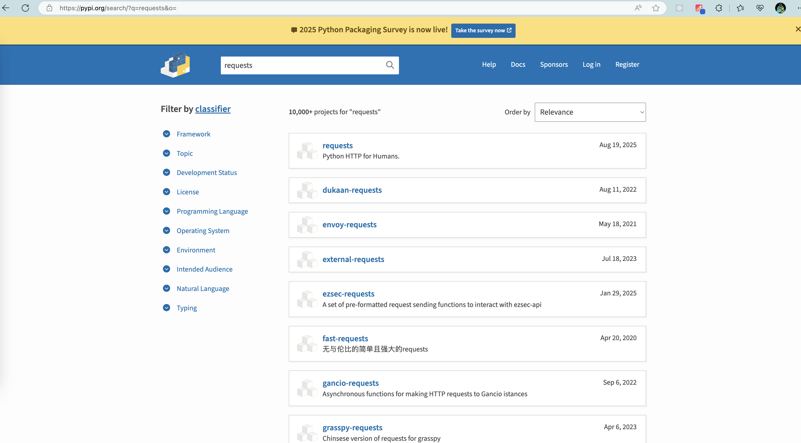
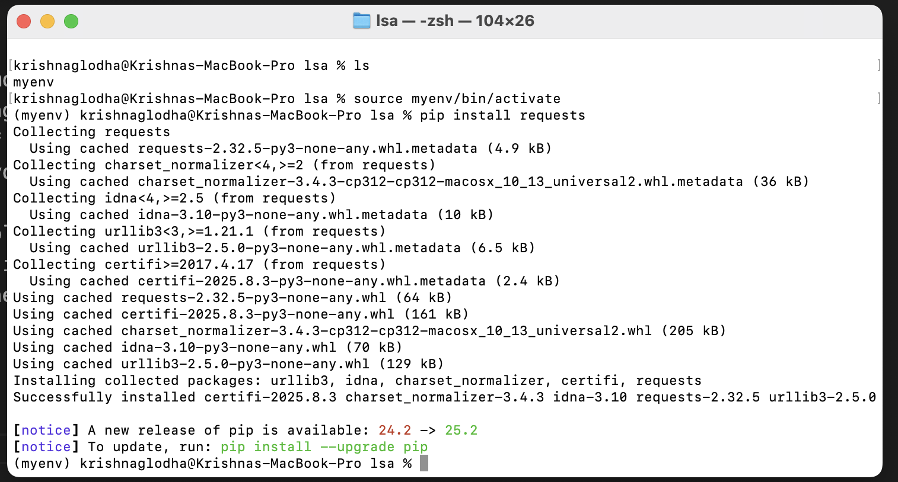
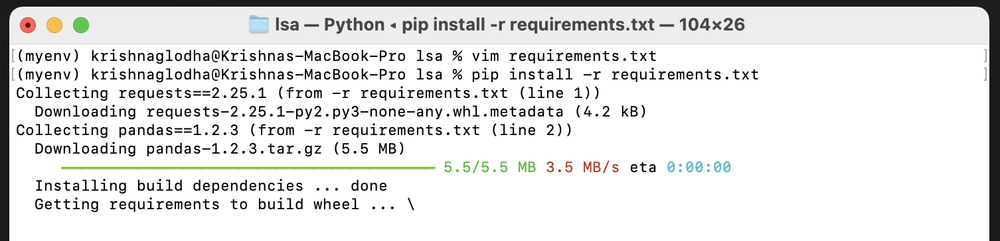
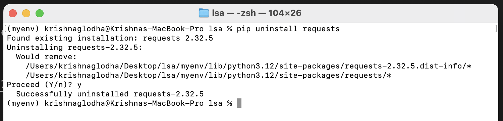
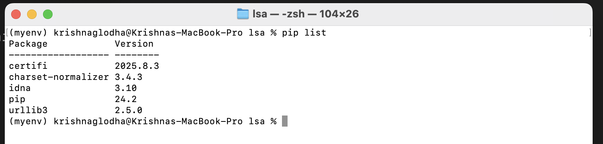

# Python Packages

One of the reasons why Python is so loved and respected language is its vast ecosystem of packages and libraries. These packages are developed by the community and are available on [PyPI](https://pypi.org/) (Python Package Index). These packages can be easily installed using `pip`, which is the package manager for Python. 

By making entry barrier low, Python has enabled developers to focus on solving problems rather than reinventing the wheel.

E.g. If you are a researcher and you found out an easier way to loop through a list with million elements, you can create a package and share it with the community. This way, other developers can use your package and benefit from your work. This might seem like a small contribution, but it can have a huge impact since this can be used by applications such as web servers, data analysis tools, machine learning libraries, etc. and without you knowing it, your package might be used by thousands of developers around the world..

This is the power of open source and community driven development. 

If you want to check the list of packages available globally, you can check the [PyPI](https://pypi.org/) website



## Installing Packages

We are living in a time where we have packages for almost everything. From web development to data analysis, from machine learning to game development, there is a package for everything. if you are a data scientist, you might be using packages like `pandas`, `numpy`, `matplotlib`, etc. If you are a web developer, you might be using packages like `Django`, `Flask`, etc. If you are a game developer, you might be using packages like `Pygame`, etc. 

To install a package, you can use the `pip` command followed by the package name. Make sure that you have your virtual env running before you install any package, otherwise it will be install globally, which might create conflicts. If you want to install the `requests` package, you can run the following command in your terminal:

```bash
pip install requests
```

by running this command it will install all necessary packages needed to run the `requests` package. You can also specify the version of the package that you want to install. For example, if you want to install version `2.25.1` of the `requests` package, you can run the following command:

```bash
pip install requests==2.25.1
``` 



You can also install multiple packages in one go by specifying the package names separated by space. For example, if you want to install `requests`, `pandas`, and `numpy` packages, you can run the following command:

```bash
pip install requests pandas numpy
``` 

## Installing from requirements.txt

While working on a project, you might be using multiple packages. To make it easier to install all the packages needed for a project, you can create a `requirements.txt` file. This file contains a list of packages along with their versions that are required for your project.

Here is an example of a `requirements.txt` file:

```txt
requests==2.25.1
pandas==1.2.3
numpy==1.19.5
```

Create a file named `requirements.txt` in your project directory and add the above content to it. then, to install all the packages listed in the `requirements.txt` file, you can run the following command:

```bash
pip install -r requirements.txt
``` 

This command will read the `requirements.txt` file and install all the packages listed in it along with their specified versions. This is a very useful way to manage dependencies for your project and ensure that everyone working on the project has the same packages installed.



## Uninstalling Packages

To uninstall a package, you can use the `pip uninstall` command followed by the package name. For example, if you want to uninstall the `requests` package, you can run the following command:

```bash
pip uninstall requests
```

This will shown a prompt asking for confirmation to uninstall the package. Type `y` and press `Enter` to confirm the uninstallation.



## Listing Installed Packages

To list all the packages installed in your virtual environment, you can use the `pip list` command. This will show a list of all the packages along with their versions that are currently installed in your virtual environment.

```bash
pip list
```


