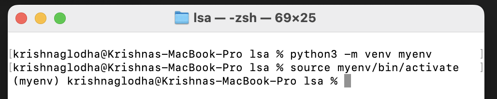
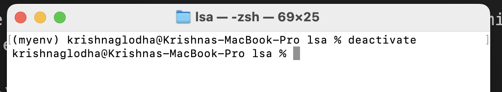

# Setup Python Environment

Once you have installed python, you can start working with it. Generally when we work with python, we install `External Packages` which are not part of standard library. These packages are developed by community and are available on [PyPI](https://pypi.org/) (Python Package Index).  But installing these packages globally can lead to version conflicts. For example, you might have two projects, one which requires `pandas v1.5.0` and another which requires `pandas v2.0.0`. Installing both versions globally is not possible and can lead to conflicts. To avoid this, we use `Virtual Environments` which are isolated environments for each project. This way, we can have different versions of packages for different projects without any conflicts. 

## `venv` Virtual Environment

### Creating Virtual Environment
There are several ways to create virtual environments in python. The most common way is to use `venv` module which is part of standard library. To create a virtual environment, open terminal and navigate to your project directory and run following command

```bash
# if you have python installed as python3
python -m venv myenv

# else you can use python3
python3 -m venv myenv
```

The above command will create a virtual environment named `myenv` in your project directory. You can name it anything you want. 

### Activating Virtual Environment

After creating the virtual environment, you need to activate it. To activate the virtual environment, run following command

```bash
# on Windows
myenv\Scripts\activate
# on MacOS and Linux
source myenv/bin/activate
```

After activating the virtual environment, you will see the name of the virtual environment in your terminal prompt. This indicates that you are now working inside the virtual environment.



### Deactivating Virtual Environment

To deactivate the virtual environment, simply run

```bash
deactivate
```

you can confirm this by checking the terminal prompt, it should not have the name of the virtual environment anymore.



## `Conda` Virtual Environment

[Anaconda](https://anaconda.org/anaconda/conda) is also a popular virtual environment management solution, it also has an open source version which can be used without any licensing cost. This is typically easy to manage and share compared to `venv`.

Checkout Installation documentation to add conda to your system and your path.

### Creating Conda Virtual Environment

To create environment at minimum you just have to pass env name, along with that you can also mention python package  or version that you want to install initially. 

```bash
# Create conda env with name `mycondaenv` and python version 3.12
conda create -n mycondaenv python==3.12
```
This will install all necessary packages to run python=3.12

### Activate Virtual Environment

Conda stored all packages and envs in its own directory, so you can activate the env from anywhere in your system. To activate the virtual environment, run following command

```bash
conda activate mycondaenv
```
After activating the virtual environment, you will see the name of the virtual environment in your terminal prompt. This indicates that you are now working inside the virtual environment.

### Deactivate Virtual Environment

To deactivate conda environment, you can run the following command

```bash
conda deactivate
```

This will deactivate whatever conda environment is running currently.

